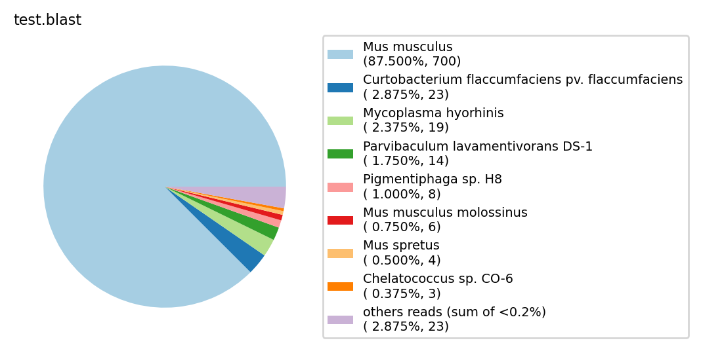

---

# 简介

项目简介：

- 建立本地 blast nt 数据库，进行随机抽取1000条reads，进行nt比对统计物种的含量并绘制饼图。
- 优化blast比对效率，即合并所有输入fasta，一次性读取数据库比对，最后对于blast结果分割
- 该项目主要奉献了脚本用于nt数据库id查找名的优化，为遍历大文件查找提供了一种最有效率的方式。
- 实现思想：将大文件先排序，然后分割成各个小文件库，在查找时，按照一定规律按需去导入各个小文件库进行查找，从而大大降低资源消耗。


map_taxid 测试效果：

```bash
# 搜索效率大大提升，并附带各类统计及绘图功能
time ./map_taxid.py ./test/test.blast
# real    0m12.926s
# user    0m9.968s
# sys     0m2.923s

# 而使用 linux awk 去搜索
time {
    db=/home/chenjun/dataBase/blast_db_FASTA/
    cat test.blast | sort -k1,1 -u >test.filter.blast
    cat test.filter.blast |cut -f 2 >keys.txt
    # 下面这一步占了99%的时间，为1m20s
    awk 'NR==FNR{a[$1]=$2;next}NR!=FNR{if($1 in a)print $0}'  keys.txt  ${db}/db_NCBI_Taxonomy/nucl_gb.accession2taxid.filter.sorted.txt >find.txt
    cut -f 2 find.txt  >find.txt.col1
    awk 'NR==FNR{a[$1]=$0;next}NR!=FNR{if($1 in a)print a[$0]}'  ${db}/db_NCBI_Taxonomy/taxdump/names.dmp.db find.txt.col1 >find_res.xls
    # \rm test.filter.blast keys.txt find.txt.col1
}
# real    1m22.207s
# user    1m20.908s
# sys     0m0.939s
```


多个fasta的blast比对效率测试效果：

```bash
# 优化后，30000条reads * 1个文件, 用blast与NT库比对一共耗时约30余分钟
blastn -query merge_infastas.fa -out merge_infastas.fa.blast -outfmt 6 -db /home/chenjun/dataBase/blast_db_FASTA/nt -num_threads 10 -num_alignments 5
# 0:34:41.519622

# 优化前，10000条reads * 3个文件, 用blast与NT库比对一共耗时约90余分钟
blastn -query 10000reads_demo1.fasta -out 10000reads_demo1.fasta.blast -outfmt 6 -db /home/chenjun/dataBase/blast_db_FASTA/nt -num_threads 10 -num_alignments 5
# real    27m12.249s
# user    56m57.813s
# sys     3m49.708s
blastn -query 10000reads_demo2.fasta -out 10000reads_demo2.fasta.blast -outfmt 6 -db /home/chenjun/dataBase/blast_db_FASTA/nt -num_threads 10 -num_alignments 5
# real    32m1.481s
# user    86m28.424s
# sys     4m31.387s
blastn -query 10000reads_demo3.fasta -out 10000reads_demo3.fasta.blast -outfmt 6 -db /home/chenjun/dataBase/blast_db_FASTA/nt -num_threads 10 -num_alignments 5
# real    38m15.928s
# user    83m30.482s
# sys     4m26.641s
```

- 时间有限，在IO吞吐量方面未记录数据。但是一个NT库本地大小为120G左右，分开3次跑和1次跑的最大区别就在于，后者只读取了一次NT库，因此合并fasta再跑速度提升的根本在于优化了IO读取量。


---
# 使用说明

## nt本地库的下载及构建

构建代码：

```bash
db=$PWD

## 1.环境配置
# blast, numpy, pandas, matplotlib, pickle ... 安装
# 尽量使用官方源，一般具有更新的环境版本不易出现问题。访问缓慢可借助 proxychains4 解决。
conda deactivate; conda deactivate;
conda create  -y  -n nt  -c bioconda  blast libgcc numpy pandas matplotlib seqtk
conda activate nt
pip install biopython
# blast版本地址：<https://ftp.ncbi.nlm.nih.gov/blast/executables/LATEST/>
# blast使用手册《BLAST Command Line Applications User Manual》


## 2.下载所需数据库
# 下载blast的数据库，nt为核酸数据库，nr为蛋白质数据库。以及物种信息对应的数据库，NCBI Taxonomy 数据库下载。
# https://ftp.ncbi.nih.gov/blast/db/FASTA/
wget -c -t 0  https://ftp.ncbi.nih.gov/blast/db/FASTA/nt.gz
wget -c -t 0  https://ftp.ncbi.nlm.nih.gov/pub/taxonomy/accession2taxid/nucl_gb.accession2taxid.gz -O db_NCBI_Taxonomy/
wget -c -t 0  https://ftp.ncbi.nlm.nih.gov/pub/taxonomy/taxdump.tar.gz -O db_NCBI_Taxonomy

# 构建nt数据库
zcat nt.gz >nt
makeblastdb -in nt -parse_seqids -hash_index -dbtype nucl -logfile nt_logfile

# 提取Taxonomy，处理物种对应信息, taxid必须排序
cd db_NCBI_Taxonomy
zcat nucl_gb.accession2taxid.gz | cut -f 1,3|sed 1d|sort -k1 > nucl_gb.accession2taxid.filter.sorted.txt
tar xzvf taxdump.tar.gz
cd -
# cd taxdump
# grep "scientific name" names.dmp >names.dmp.db

## 3. 构建搜索ID用的pydb, map_taxid.py中的pydb路径需要自己指定
conda activate nt
# blast 略，需要格式参数-outfmt 6
sed -i "s#/home/chenjun/dataBase/blast_db_FASTA#$db#"  map_taxid.py 
python3  map_taxid.py  test/test.blast
```

---
## Demo：

分步执行：

```bash
db=/home/chenjun/dataBase/blast_db_FASTA/nt

conda activate nt
fastq=test.fq.gz
num=1000
fasta=test.fa
out=test.blast

# 筛选1000 条 reads 准备进行 blast nt 比对
./get_1000reads.sh 
seqtk sample -s 100 $fastq ${num}  >${num}reads_${fastq_name}
cat ${num}reads_${fastq_name} | awk '{if(NR%4 == 1){print ">" substr($0, 2)}}{if(NR%4 == 2){print}}' >$fasta

# blast执行
time blastn -query $fasta -out $out -outfmt 6 -db $db -num_threads 10 -evalue 1e-5  -qcov_hsp_perc 50.0 -num_alignments 5
# blast结果的物种查找
time python3 map_taxid.py $out
```


一步执行：【流程中使用的关键脚本！！！】

```bash
conda activate nt
# 早期版本只能一个一个fasta做。（可忽略了）
./fq-nt-check.sh  ./test.fq.gz
# 后期版本能同时多个fasta做，并可指定随机挑选reads条数。（推荐）
./fq-nt-checks.sh -i ./test1.fq.gz ./test2.fq.gz ./test3.fq.gz -n 10000
```

饼图结果：




---
# 附

## Taxonomy数据库说明

Taxonomy数据库格式说明：
（一般blast比对后的结果为第1/2列所示，我们需要通过1/2列找到对应3列，然后在names.dmp去找到对应物种名并进行统计）

```bash
# nucl_gb.accession2taxid.gz
# 第一列Accession ： 序列标识码
# 第一列Accession.version : 带版本号的序列标识码
# 第三列： 序列的taxid 号，即物种分类号。如 Homo sapiens 的是9606.
# 第四列：序列的gi号
# accession  accession.version  taxid  gi
# A00001     A00001.1           10641  58418
# A00002     A00002.1           9913   2
# A00003     A00003.1           9913   3
# A00004     A00004.1           32630  57971
# A00005     A00005.1           32630  57972
# A00006     A00006.1           32630  57973
# A00008     A00008.1           32630  57974
# A00009     A00009.1           32630  57975
# A00010     A00010.1           32630  57976


# taxdump.tar.gz 解压后会有7个库，我们用 names.dmp
# names.dmp 中包含物种的taxid号与物种学名。对应的格式如下：
# 第1列为 物种的taxid号。
# 第2列为物种名称。
# 第3列为物种名称及类
# 第4列为该行的信息类型。我们后面会选择 scientific name 信息的行，对应的物种学名。
# 1 	| 	all         	| 	                       	| 	synonym             	|
# 1 	| 	root        	| 	                       	| 	scientific name     	|
# 2 	| 	Bacteria    	| 	Bacteria <bacteria>    	| 	scientific name     	|
# 2 	| 	bacteria    	| 	                       	| 	blast name          	|
# 2 	| 	eubacteria  	| 	                       	| 	genbank common name 	|
# 2 	| 	Monera      	| 	Monera <bacteria>      	| 	in-part             	|
# 2 	| 	Procaryotae 	| 	Procaryotae <bacteria> 	| 	in-part             	|
# 2 	| 	Prokaryotae 	| 	Prokaryotae <bacteria> 	| 	in-part             	|
# 2 	| 	Prokaryota  	| 	Prokaryota <bacteria>  	| 	in-part             	|
# 2 	| 	prokaryote  	| 	prokaryote <bacteria>  	| 	in-part             	|

```


---
## blast耗时统计

单个blast, 10进程运行测试：

IO读取速度大约在100M/s

|序列数量|耗时|
|-|-|
|1000|12min|
|10000|22min|
|60000|60min|

平均每增加 10000 条序列，将会增加 10min 运行时间。

---
## 参考文档


blast-nt库的构建参考文章: 

- [通过 blast 结果查看 测序数据fastq是否被污染，以及污染reads所属物种、所占比例_风风是超人的博客-CSDN博客](https://blog.csdn.net/qq_42962326/article/details/105081327)
- [使用本地nt数据库对reads和Trinity结果进行blast - 简书](https://www.jianshu.com/p/b8225e806aca)


---
## 下一步更新计划

- [x] 编写脚本，一次性将所有要检测的reads的fasata合并起来，然后再一次性进行blast，可以大大减少IO读取量提升速度
- [ ] 整理安装方法，去除绝对路径，整合代码以供任何人轻易使用
- [ ] 解决 RNA-seq 对于 blast nt库 不正常问题，详细描述可见 [note-RNA/demo.md](note-RNA/demo.md)
    - [ ] 需要进一步确认是否因为RNA-seq具有可变剪切缘故，与nt比对出现的这种误差。 nt库是否收录的都是DNA序列？ RNA一般采用cDNA建库获得的reads一般都是可变剪切后的。
    - [ ] 尝试更换数据库： 
        - [RefSeq - Wikipedia](https://en.wikipedia.org/wiki/RefSeq)
        - 比对失败： [Index of /blast/db](https://ftp.ncbi.nih.gov/blast/db/)

